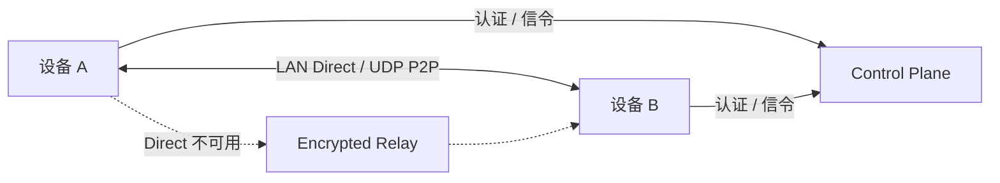

<p align="center">
  
</p>

<div align="center">
  <h1>P2WLAN</h1>
  <p><strong>让异地设备像在同一局域网中一样互联。</strong></p>
  <p>P2P 优先 · NAT 穿透 · Relay 自动回退 · 跨平台 · 房间互联 · 可自托管</p>

  <p>
    <a href="README.md"><strong>简体中文</strong></a>
    · <a href="README.en.md">English</a>
  </p>

  <p>
    <a href="https://github.com/yhan-sun/p2wlan/releases"><strong>下载</strong></a>
    · <a href="#快速开始">快速开始</a>
    · <a href="#界面预览">界面预览</a>
    · <a href="#适用场景">适用场景</a>
    · <a href="#工作方式">工作方式</a>
    · <a href="#自托管">自托管</a>
  </p>

  <p>
    <a href="https://github.com/yhan-sun/p2wlan/releases"></a>
    <a href="https://github.com/yhan-sun/p2wlan/actions/workflows/ci.yml"></a>
    <a href="LICENSE"></a>
  </p>

  <p>
    <a href="https://trendshift.io/repositories/239992"></a>
    <a href="https://trendshift.io/repositories/239992"></a>
  </p>
</div>

## P2WLAN 是什么

P2WLAN 是一个开源、P2P 优先、可自托管的虚拟局域网工具。它为设备分配私有虚拟 IP，让分布在家庭宽带、移动网络、校园网、云服务器等不同网络中的设备，能够像在同一个局域网里一样通信。

连接建立时，P2WLAN 会优先尝试 **LAN Direct / 公网 UDP P2P**；如果当前 NAT、防火墙或网络环境不允许直连，则自动回退到 **Encrypted Relay**。业务侧仍然使用同一个虚拟 IP，不需要为每台设备单独维护公网端口、动态域名或复杂路由。

> [!IMPORTANT]
> P2WLAN 当前仍处于 **Preview** 阶段，适合真实网络测试、自托管和开发验证。项目尚未完成独立安全审计；P2WLAN 也不是官方 WireGuard 实现，不声明 WireGuard 互操作兼容。

## 一眼看懂

| 能力 | 说明 |
| --- | --- |
| **P2P First** | 能直连就不经过中继，优先使用局域网和公网 UDP。 |
| **NAT Traversal** | 自动探测网络环境并尝试 UDP 打洞；复杂 NAT 下不保证一定成功。 |
| **Relay Fallback** | Direct 不可用时自动切换到加密 Relay，尽量保证连接可用。 |
| **End-to-End Encryption** | 设备间数据通过加密会话传输，Relay 只负责转发密文。 |
| **Rooms** | 用房间组织临时或固定的一组设备，适合朋友联机、协作和私有服务互通。 |
| **Cross-platform** | GUI 覆盖 Windows、macOS、Linux 与 Android；iOS 仍为实验性预览；CLI / daemon 适合服务器和无桌面环境。 |
| **Self-hosted** | Control Plane、SQLite 与 Relay 可以部署到自己的 Linux 服务器。 |

## 界面预览

<table align="center">
    <tr>
      <td align="center" width="50%">
        <br />
        <sub>首页 · 网络状态与在线设备</sub>
      </td>
      <td align="center" width="50%">
        <br />
        <sub>设备 · 节点、速率与在线状态</sub>
      </td>
    </tr>
    <tr>
      <td align="center" width="50%">
        <br />
        <sub>互联 · 房间管理与连接延迟</sub>
      </td>
      <td align="center" width="50%">
        <br />
        <sub>房间详情 · 虚拟 IP、连接路径与延迟</sub>
      </td>
    </tr>
</table>

从全局网络状态、设备在线情况，到多房间管理、连接方式和端到端延迟，常用信息可以直接在客户端里看到。设备名称和截图数据均为演示数据。

## 适用场景

P2WLAN 提供一张跨地域的虚拟三层网络。应用通过对端的虚拟 IP 和业务端口通信；目标服务需要监听可访问的地址，并允许对应的防火墙流量。

| 场景 | 可以怎么用 |
| --- | --- |
| **NAS / HomeLab** | 在外网访问运行 P2WLAN 的 NAS、家庭服务器或虚拟机上的服务，不必逐个暴露公网端口。 |
| **Minecraft 联机** | 把朋友的电脑加入同一房间，直接使用虚拟 IP 访问自建 Minecraft 服务器。 |
| **Terraria 联机** | 将不同网络中的玩家组织到同一虚拟网络，进行多人联机。 |
| **自建服务器** | 访问 Web 应用、API、数据库、面板、游戏服以及仅希望在私网开放的服务。 |
| **远程开发** | SSH、RDP、数据库连接、开发测试机互联，以及跨地区设备调试。 |
| **跨地域组网** | 家庭宽带、移动热点、校园网、云主机和不同云厂商之间互联。 |

安装 P2WLAN 不会自动把所在家庭或办公网络中的其他设备接入虚拟网络。上面的访问示例以目标设备也运行 P2WLAN 为前提。

### 房间：把“我要和谁互联”单独组织起来

房间适合需要独立边界的临时或固定网络：例如一个 Minecraft 生存服、一次朋友联机、一组 NAS 维护设备，或者一个开发测试环境。客户端可以集中查看房间成员、在线状态、虚拟 IP、当前连接路径和延迟，不需要把所有设备混在同一个列表里。

## 快速开始

**先准备 Control 地址。** 新安装不预填项目运营的 Control 或 Relay，也不会自动注册账号。请向管理员获取可信的 Control 地址，或先完成[自托管部署](docs/guides/self-hosting.md)。需要互联的设备应使用同一个 Control；不同账号之间通过同一房间互联。

### 1. 下载

前往 [GitHub Releases](https://github.com/yhan-sun/p2wlan/releases)，选择客户端 **`vX.Y.Z`** 发布中的对应平台文件。服务端 **`server-vX.Y.Z`** 是独立发布，不是客户端安装包。

| 平台 | Release 文件 | 状态 |
| --- | --- | --- |
| macOS 12+ Apple Silicon | `p2wlan-macos-arm64.dmg` | 支持 |
| macOS 12+ Intel | `p2wlan-macos-x64.dmg` | 支持 |
| Windows x64 | `p2wlan-windows-x64-setup.exe` | 支持 |
| Linux x64 | `p2wlan-linux-x64.tar.gz`（GUI） / `p2wlan-linux-x64-cli.tar.gz`（CLI + daemon） | 支持 |
| Linux arm64 | `p2wlan-linux-arm64-cli.tar.gz`（CLI + daemon） | 支持 |
| Android 7.0+ (API 24+) arm64 | `p2wlan-android-arm64-release.apk` | 支持 |
| iOS 15+ arm64 | `p2wlan-ios-arm64-unsigned.ipa` | 实验性，需签名 |

Linux 无桌面环境选择 CLI 包，也可使用固定版本安装脚本。把 `vX.Y.Z` 替换为实际客户端 Release 标签：

```bash
P2WLAN_VERSION=vX.Y.Z
curl -fsSL "https://raw.githubusercontent.com/yhan-sun/p2wlan/$P2WLAN_VERSION/scripts/install-linux-cli.sh" -o /tmp/p2wlan-install.sh
sudo sh /tmp/p2wlan-install.sh --version "$P2WLAN_VERSION"
```

### 2. 配置 Control

在客户端登录页的“高级选项 → 自托管服务器”中填写 Control 地址。`https://control.example.com` 仅是占位示例，需要替换为实际服务器地址。CLI 使用：

```bash
p2wlan config set control https://control.example.com
```

### 3. 注册／登录

在客户端注册账号或登录已有账号。CLI 登录已有账号：

```bash
p2wlan login -u your-name
p2wlan account show
```

没有账号时，使用 `p2wlan register -u you@example.com` 注册并保存登录状态；注册需要邮箱，登录可使用邮箱或已设置的用户名。密码由终端提示输入。配置和登录命令使用普通用户执行，不要加 `sudo`。

### 4. 连接设备

**自己的设备互联：** 在各设备上登录同一账号，完成首次设置并启动个人网络。CLI 使用：

```bash
p2wlan up
p2wlan status
```

**与朋友或其他账号互联：** 各设备使用同一个 Control，在客户端创建房间或通过房间号／邀请加入，再点击房间中的“连接本机”。加入房间只建立成员关系，不会自动启动本机网络。

CLI 房主先用 `p2wlan room create --name my-room` 创建房间，按提示设置房间密码，并将房间号交给其他成员。其他成员加入后，房主和成员都需要连接该房间：

```bash
# 成员加入：将 12345678 替换为实际的 8 位房间号，按提示输入房间密码
p2wlan room join --code 12345678
# 房主和成员：查看房间，并连接本机
p2wlan room list
p2wlan room connect 12345678
p2wlan room show 12345678
```

房间使用独立的网络和虚拟 IP。`p2wlan up` 启动个人网络，不能代替 `p2wlan room connect`。设备可能需要房主批准后才能通信；详细操作见[房间指南](docs/guides/rooms.md)。

### 5. 使用虚拟 IP

等待对端连接后，从设备列表或房间详情获取对端在当前网络中的虚拟 IP。下面以房间内的演示地址 `10.21.0.5` 为例，请替换为实际地址：

```bash
ping 10.21.0.5
ssh user@10.21.0.5
```

游戏服务器、NAS、Web 面板或数据库同理：连接对端虚拟 IP 和对应业务端口。登录成功、设备在线或出现 Direct/Relay 标签都不能单独证明业务可达，应实际验证目标服务。

### 6. 查看连接路径

客户端会显示对端当前使用的路径。遇到问题时，可先运行：

```bash
p2wlan status --json
p2wlan doctor
p2wlan route verify
p2wlan logs -f
```

`p2wlan support-bundle` 可生成本地诊断包；只有确认接收方、内容和保存期限后，才显式添加 `--upload` 上传。更多操作见[客户端指南](docs/guides/client.md)、[CLI 参考](docs/reference/cli.md)和[排障指南](docs/guides/troubleshooting.md)。

## 工作方式

P2WLAN 将连接控制和数据传输分开：

- **Control Plane**：身份、设备、虚拟 IP、凭据和信令。
- **Rust daemon**：虚拟网卡、路由、Peer、NAT traversal、加密数据面和路径选择。
- **Relay**：只在 Direct 不可用时参与，负责转发密文。



连接策略可以概括为：

**LAN Direct → Public UDP Direct → Encrypted Relay**

Direct 能否建立取决于两端真实网络环境。NAT、CGNAT、防火墙、云安全组等都可能阻止直连；此时 Relay 是后备路径，而不是对任意网络环境 P2P 成功率的承诺。

## 连接状态

| 状态 | 含义 |
| --- | --- |
| **LAN Direct** | 通过本地网络直接通信。 |
| **Direct** | 通过公网 UDP 建立 P2P 直连。 |
| **Relay** | 通过 Relay 转发加密数据。 |
| **Connecting** | 正在建立或确认连接路径。 |
| **Offline** | 对端离线或当前没有可用路径。 |

## 技术架构

| 模块 | 技术 | 职责 |
| --- | --- | --- |
| GUI | Flutter | 登录、设备 / 房间管理、连接状态与诊断。 |
| Data Plane / Daemon | Rust | TUN、路由、Peer、NAT traversal、加密会话与 Relay fallback。 |
| Virtual interface | macOS `utun` / Windows Wintun / Linux TUN | 为应用提供普通的三层虚拟网络接口。 |
| Control Plane | Go + SQLite | 认证、设备注册、虚拟 IP、凭据、信令和 Relay 信息。 |
| Relay | Go | Relay 连接、票据校验和密文转发。 |

P2WLAN 使用自包含的 **WireGuard-like Noise** 数据面，并使用 X25519、ChaCha20-Poly1305、BLAKE2s 等密码学组件。**P2WLAN 不是官方 WireGuard 实现，也不声明 WireGuard 互操作兼容。**

## 自托管

Control Plane 和 Relay 位于 [`server/`](server/)。固定服务端发布包使用 **`server-vX.Y.Z`** 标签，公开安装与升级路径为 **Linux + systemd**；普通部署不需要在服务器上安装 Go 或 Node.js。

部署需要可信的 Control HTTPS/WSS 入口、Relay TLS 入口、持久化数据库和匹配的认证配置。仅启动服务端不会使服务器自动成为虚拟网络节点；需要作为节点时，还应安装并连接客户端。

- [自托管指南](docs/guides/self-hosting.md)：固定版本安装、配置、TLS、管理台与 Docker Compose 边界。
- [升级与恢复](docs/guides/upgrade-and-recovery.md)：备份、升级、恢复与回滚。
- [运维指南](docs/guides/operations.md)：服务管理、健康检查、日志与证书。

## 安全边界

- 设备业务流量通过端点间的加密数据面传输。
- Relay 转发密文，不负责解密业务载荷。
- Relay 仍可能观察连接相关元数据，例如节点标识、时间和数据包大小。
- 项目处于 **Preview**，尚未完成独立安全审计。
- 不保证任意 NAT 环境都能建立 P2P 直连；Relay 可用性同样依赖 Control Plane 和 Relay 可达。
- 高敏感生产环境请在部署前自行完成安全评估。

凭据边界和安全限制见 [SECURITY.md](SECURITY.md)、[隐私说明](PRIVACY.md) 与[安全模型](docs/explanation/security-model.md)；发布资产对应关系见[发布契约](docs/reference/release-contract.md)。

## 开发者

Flutter 开发和发布统一使用 **Flutter 3.47.2 / Dart 3.13.2**，仓库根目录 `.fvmrc` 是本地 FVM、CI 和发布流水线的版本来源。

仓库按职责拆分：

- [`apps/flutter_client/`](apps/flutter_client/) — Flutter 客户端
- [`client/daemon/`](client/daemon/) — Rust daemon
- [`client/cli/`](client/cli/) — Rust CLI
- [`client/tun/`](client/tun/) — TUN / 虚拟网卡抽象
- [`client/crypto/`](client/crypto/) — 加密组件
- [`server/`](server/) — Go Control Plane
- [`server/relay/`](server/relay/) — Go Relay

构建、检查与贡献约定见 [CONTRIBUTING.md](CONTRIBUTING.md)，完整文档入口见 [docs/README.md](docs/README.md)。实现细节请优先以源码、测试和 CI 为准。

## License

[MIT](LICENSE)
